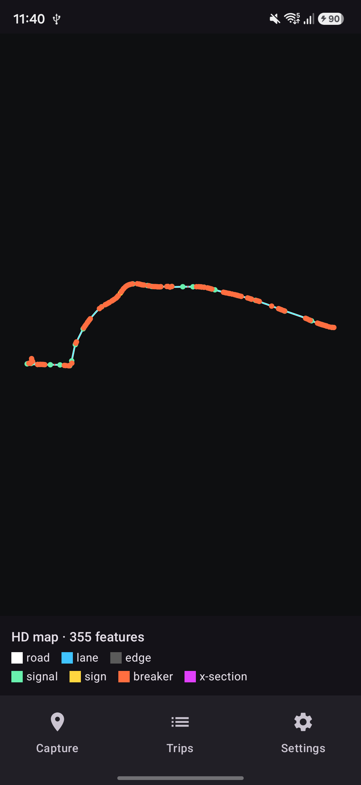
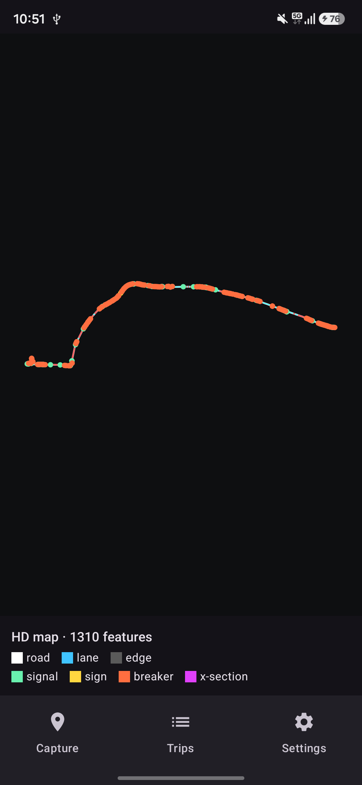
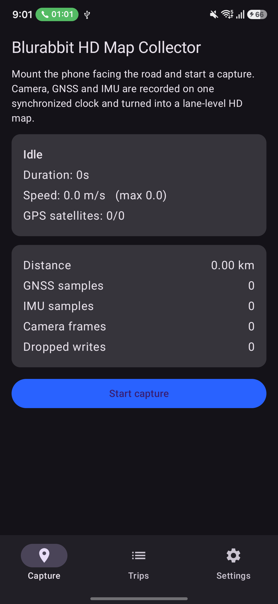
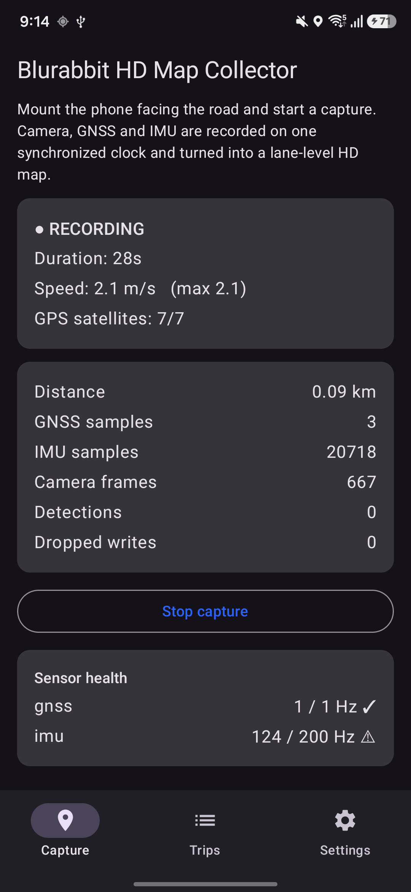
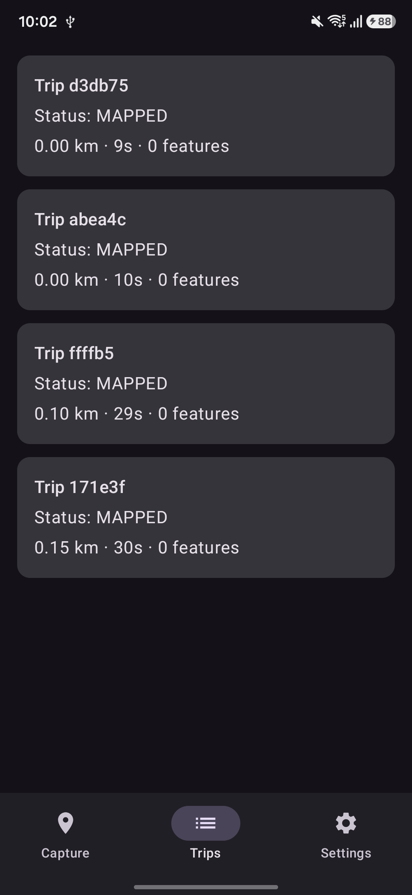

<div align="center">

# Blurabbit HD Map Collector

### Turn any Android phone into an HD mapping device for self driving cars.

Mount it on your windshield, drive, and get a lane level HD map with traffic signals, road conditions, and road intelligence scores. No LiDAR. No survey vehicle. No cloud required. Just a phone.


</div>

<div align="center">

</div>

> This is not a navigation app. It is an HD map generation platform.

---

## The 30 second pitch

HD maps are the hidden fuel of autonomous vehicles, and today they cost a fortune to build with specialized vehicles, spinning LiDAR rigs, and armies of human labelers. Blurabbit flips the model. Every phone becomes a mapping probe. You drive normally, and the app fuses camera, GNSS, and IMU into a lane level map that exports straight into the formats that AV simulators and stacks already speak: OpenDRIVE, Lanelet2, and GeoJSON.

Think of it as crowd sourced HD mapping, the way Mapillary did street imagery and Waze did traffic, but for the lane level maps that robots actually drive on.

---

## It actually works. Here is a real drive.

A single 3.9 km, 14 minute drive through Bangalore, captured and processed entirely on a Samsung Galaxy A17, no internet needed:

| Signal | What the phone produced |
| --- | --- |
| Road geometry | 3.9 km road segment, lane centerline, and left/right road edges from GNSS, smoothed by a visual inertial filter |
| Traffic lights and signs | 221 raw camera detections, deduplicated to 31 signals and 2 stop signs |
| Road surface | speed breakers and rough surface events detected from the accelerometer, georeferenced |
| Visual odometry | 1480 frame to frame motion estimates, 42 to 100 tracked features per frame, 106.6 degrees of cumulative visual yaw tracking the turns |
| Output | one tap export to GeoJSON, OpenDRIVE (.xodr), and Lanelet2 (.osm) |

The raw map had 1310 features. A within trip deduplication pass collapsed repeated sightings of the same object into clean features, taking it to 355.

<div align="center">

&nbsp;&nbsp;&nbsp;

<br/>
<sub><b>Left:</b> raw, every camera frame and bump. &nbsp; <b>Right:</b> deduplicated, one feature per real object.</sub>
</div>

A copy of this exact drive lives in [`sample-data/`](sample-data/) so you can open it in any GIS tool right now.

---

## Everything runs on the phone

No server is required to make a map. The full pipeline is on device:

```
 Camera ─┐
 GNSS   ─┼─► nanosecond clock sync ─► visual inertial trajectory ─► HD map ─► auto export
 IMU    ─┘            │                        │
                      ▼                        ├─ on-device AI: traffic lights, stop signs (SSD MobileNet)
              SystemClock.elapsedRealtimeNanos ├─ drivable area + road width (TwinLiteNet)
              drift detection + validation     ├─ monocular visual odometry (feature tracking)
                                               └─ IMU road events: speed breakers, potholes, rough surface
```

- **Synchronized capture.** CameraX at 1080p, GNSS with full constellation support including NavIC, and IMU at 100 Hz plus, all stamped on one monotonic clock with drift detection.
- **On device perception.** A real SSD MobileNet COCO model detects traffic lights and stop signs. A TwinLiteNet model segments the drivable area and estimates road width. Both run with no network.
- **Monocular visual odometry.** A pure Kotlin feature tracking front end estimates frame to frame ego motion and visual yaw, the tracking stage of a visual SLAM system.
- **Visual inertial fusion.** A Kalman filter fuses GNSS, IMU, and visual yaw into a smooth, drift corrected trajectory.
- **Road intelligence.** Every road segment gets health, quality, safety, traffic density, and construction scores.

<div align="center">



</div>

---

## Crowd sourced fusion

One drive is a map. A thousand drives are a living map. The backend merges overlapping trips into a consensus map:

- features observed by multiple drivers are clustered and merged
- confidence is boosted by agreement, so two independent sightings at 0.6 become a consensus at 0.84
- geometry is refined by a confidence weighted average
- every feature keeps its provenance, so you always know which drives saw it

The backend is a dependency free JVM service that reuses the exact same map schema and exporters as the app, with a portable storage layer (PostgreSQL and PostGIS in production, embedded H2 in tests) and container, Kubernetes, and Terraform manifests ready to deploy.

---

## What you can build with this data

| Domain | Use of the data |
| --- | --- |
| Autonomous driving and ADAS | OpenDRIVE and Lanelet2 maps drop into CARLA, esmini, and Autoware for simulation and localization priors |
| Road maintenance and smart cities | a continuously updated inventory of potholes, speed breakers, and road quality scores to prioritize repairs |
| Navigation and safety | speed breaker and signal warnings, smoother adaptive cruise, dashcam grade driver assist |
| Fleet and logistics | road quality aware routing to cut vehicle wear, fuel, and cargo damage |
| Map and ML companies | a queryable road database and labeled training data, the Mobileye REM and Nexar model |

---

## Architecture

Clean architecture, MVVM, modular, event driven. Thirteen Gradle modules:

```
:app          Compose UI, navigation, Hilt graph, map preview
:core:common  dispatchers, result types
:core:clock   ClockSynchronizer, DriftMonitor (the sync engine)
:domain       HD map model, geometry (WGS84 and ENU), repository interfaces
:data         Room storage
:sensors      GNSS and IMU sources (plugin pattern)
:capture      CameraX, foreground service, trip recorder, JSONL logging
:perception   SSD object detector, TwinLiteNet drivable area, visual odometry
:mapping      odometry backends, visual inertial EKF, feature extraction, dedup
:hdmap        road intelligence scoring, mapping pipeline
:export       GeoJSON, OpenDRIVE, Lanelet2, vector tile serializers
:upload       WorkManager upload queue
:backend      crowd fusion service (PostGIS, queue, REST API, deploy manifests)
```

Stack: Kotlin, Jetpack Compose, Hilt, CameraX, Room, WorkManager, kotlinx.serialization, LiteRT. Gradle 8.11, AGP 8.7, JDK 17, minSdk 31.

---

## Quick start

```bash
# JDK 17 required. The Android SDK path goes in local.properties.
./gradlew :app:assembleDebug
./gradlew test                 # 23 JVM unit tests

adb install -r app/build/outputs/apk/debug/app-debug.apk
```

In the app: grant Camera, Location, and Notification permissions, then Capture, Start, drive, Stop. The HD map generates automatically and exports under the trip. Open it from Trips, then View map.

Run the fusion backend:

```bash
./gradlew :backend:installDist
PORT=8089 ./backend/build/install/backend/bin/backend
# POST trips to /v1/trips/{id}, then GET /v1/consensus.geojson
```

---

## Sample data

[`sample-data/`](sample-data/) contains the real Bangalore drive:

- `bangalore-drive.geojson` the deduplicated HD map, openable in any GIS tool
- `bangalore-drive.hdmap.json` the native HD map model
- `detections-sample.jsonl` raw on device traffic light and stop sign detections
- `visual-odometry-sample.jsonl` raw frame to frame visual odometry estimates

---

## Roadmap

- tune the IMU road event thresholds so condition counts and scores reflect reality
- polyline fusion across drives for lane level consensus geometry
- native ORB-SLAM3 back end on the existing odometry seam for loop closure and global accuracy
- RTK GNSS, external cameras, and CAN and OBD-II sensor sources
- vector tile server and dataset search at scale

---

## Author

Built by **Sherin Joseph Roy** at [blurabbit.com](https://blurabbit.com).

If this is useful or interesting, a star helps more people find it.

## License

MIT. Bundled model files retain their original licenses.
